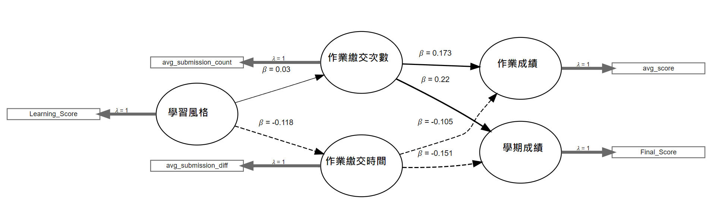

# 🎓 PLS-SEM & T-Test Analysis on Learning Behaviors and Outcomes

This project demonstrates how to apply **Partial Least Squares Structural Equation Modeling (PLS-SEM)** and **Independent Sample t-Test** using R to explore the relationships between learning styles, procrastination behaviors, and academic performance among university students.

## 📚 Overview
- **Research Topic**: Investigating how academic disciplines, gender, and learning styles influence assignment submission behaviors and learning outcomes in an online programming course.
- **Thesis Basis**: This project is derived from my master's thesis, focusing on behavioral data analysis in education.

## 🛠 Methods

### 1️⃣ PLS-SEM Analysis
PLS-SEM was used to examine the complex relationships between continuous variables, such as:
- Learning styles scores
- Average assignment submission counts
- Submission timing delays
- Assignment grades and final scores

PLS-SEM is suitable for handling multiple latent variables and exploring causal relationships when data distribution assumptions are less strict.

### 2️⃣ Independent Sample t-Test
Since **gender** is a categorical variable, it was not appropriate to include it directly in the PLS-SEM model.  
Therefore, an additional **t-test** was conducted to analyze whether there were significant differences in assignment submission behaviors between male and female students.

This combination of methods ensures both continuous and categorical variables are properly addressed in the analysis.

## 🚀 How to Run
1. Place the sample dataset in the `data/` folder.
2. Run `pls_sem_analysis.R` located in the `scripts/` directory.
3. The console will display:
   - PLS-SEM model summary
   - Bootstrap validation results
   - T-test results for gender differences

## 📈 Sample Output

- **PLS-SEM Findings**:
  - Assignment submission frequency positively impacts grades.
  - Learning styles have limited direct influence on procrastination behavior.

- **T-Test Findings**:
  - No significant difference in submission behavior between genders.

## 💡 Insights
This analysis provides insights into how learning behaviors correlate with academic outcomes, offering potential guidance for educational strategies and student support systems.

## 📖 Reference
> **Master's Thesis**:  
> *The Impact of Academic Disciplines, Gender, and Learning Styles on Online Learning-Assignment Procrastination and Learning Outcomes: Using PLS-SEM Analysis*  
> Author: Winnie Jheng (鄭宛瑜)

## 🔒 Note
Due to privacy concerns, original datasets are not included. A sample dataset structure is provided for demonstration purposes.

---
# 🎓 學習行為與學習成效之 PLS-SEM 與獨立樣本 t 檢定分析

本專案運用 R 語言，結合**偏最小平方法結構方程模型（PLS-SEM）**與**獨立樣本 t 檢定**，探討大學生的學習風格、拖延行為與學習成效之間的關聯性。

## 📚 研究概述
- **研究主題**：探討學群、性別與學習風格，對作業繳交行為與學習成效的影響。
- **專案來源**：本專案基於碩士論文實作，聚焦於教育行為數據分析。

## 🛠 分析方法說明

### 1️⃣ PLS-SEM 分析
使用 PLS-SEM 建立結構方程模型，分析以下連續型變數之間的關係：
- 學習風格量表得分
- 平均作業繳交次數
- 平均作業延遲時間
- 作業成績與學期總成績

PLS-SEM 適用於處理潛在變數間的因果關係，特別適合樣本數較小或資料常態性不足的情境。

### 2️⃣ 獨立樣本 t 檢定
由於**性別**為類別變數，不適合納入 PLS-SEM 模型中分析，因此額外進行獨立樣本 t 檢定，以檢視性別在作業繳交行為上的差異性。

透過結合兩種統計方法，能夠更全面地處理不同型態的變數特性，確保分析結果的合理性與完整性。

## 🚀 執行方式
1. 將範例資料放置於 `data/` 資料夾中。
2. 執行 `scripts` 資料夾下的 `pls_sem_analysis.R`。
3. 執行後於 Console 輸出以下結果：
   - PLS-SEM 模型摘要
   - Bootstrap 驗證結果
   - 性別差異之 t 檢定結果

## 📈 成果展示

- **PLS-SEM 分析結論**：
  - 作業繳交頻率對成績具正向影響。
  - 學習風格對拖延行為影響有限。

- **t 檢定結論**：
  - 性別在作業繳交行為上無顯著差異。

## 💡 研究啟示
本分析有助於理解學生學習行為與成效間的關聯，為教育策略制定與學習輔導提供數據依據。

## 📖 參考資料
> **碩士論文**：  
> *學群、性別與學習風格對線上學習作業拖延行為與學習成效之影響：以 PLS-SEM 分析*  
> 作者：鄭宛瑜（Winnie Jheng）

## 🔒 資料說明
因涉及個資與隱私，專案中未提供原始數據，僅提供範例資料供操作參考。

